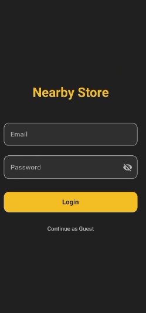
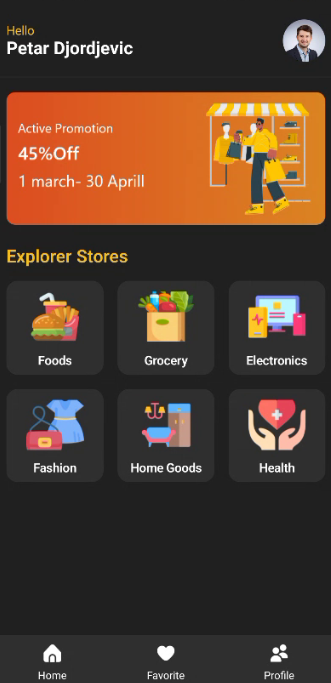
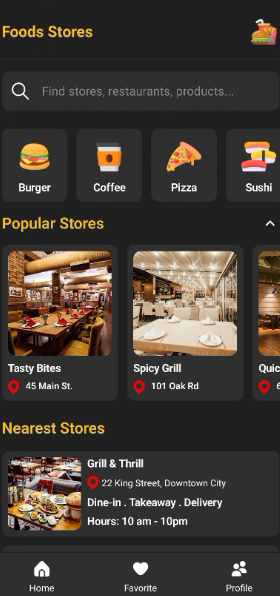
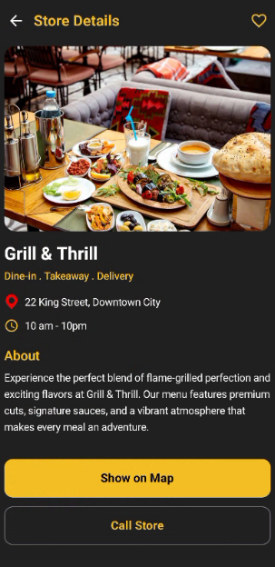
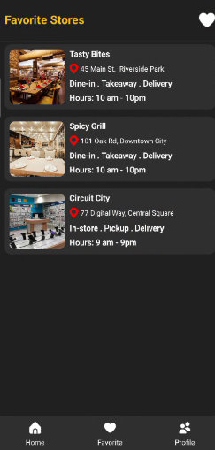
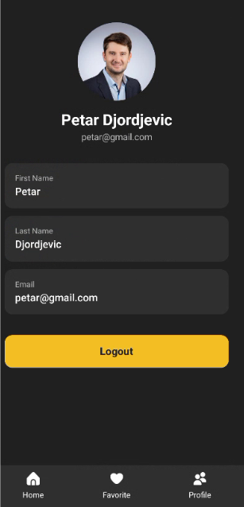

# Nearby Store

Android app for discovering nearby stores by category. Browse store categories, view details, find locations on a map, and save favorites.

## Screenshots

|   |   |   |
|:-:|:-:|:-:|
|  |  |  |
|  |  |  |
|  | | |

## Features

- Browse stores by category with subcategory filtering
- Search and filter stores
- View store details (address, distance, rating)
- Interactive map view with store location markers
- Favorites system for saving preferred stores
- User authentication with login/skip option
- User profile management

## Architecture

The app follows the **MVVM** (Model-View-ViewModel) pattern:

```
View (Jetpack Compose) → ViewModel → Repository → Firebase Realtime Database
```

| Layer | Responsibility |
|-------|---------------|
| **View** | Compose screens in `screens/` package |
| **ViewModel** | State holders in `viewModel/` package |
| **Repository** | Data access in `repository/` package |
| **Model** | Data classes in `domain/` package |

### Navigation

Type-safe navigation using Jetpack Navigation Compose with `kotlinx.serialization` route objects.

## Dependencies

| Dependency | Version | Purpose |
|-----------|---------|---------|
| Jetpack Compose (BOM) | 2024.09.00 | UI toolkit |
| Material 3 | BOM-managed | Design system |
| Navigation Compose | 2.8.5 | Type-safe navigation |
| Firebase Realtime Database | 22.0.1 | Backend data storage |
| MapLibre GL | 11.6.1 | Map rendering |
| Coil Compose | 2.7.0 | Image loading |
| Accompanist Pager Indicators | 0.36.0 | Banner carousel indicators |
| Accompanist System UI Controller | 0.36.0 | Status bar theming |
| ConstraintLayout Compose | 1.1.1 | Complex layouts |
| Kotlinx Serialization | 1.7.3 | Route serialization |

## Build & Run

**Requirements:** Android Studio, JDK 11+, `google-services.json` in `app/` directory.

```bash
# Build debug APK
./gradlew assembleDebug

# Install on connected device/emulator
./gradlew installDebug

# Run tests
./gradlew test
```

**Target SDK:** 36 | **Min SDK:** 24 | **Kotlin:** 2.1.0
